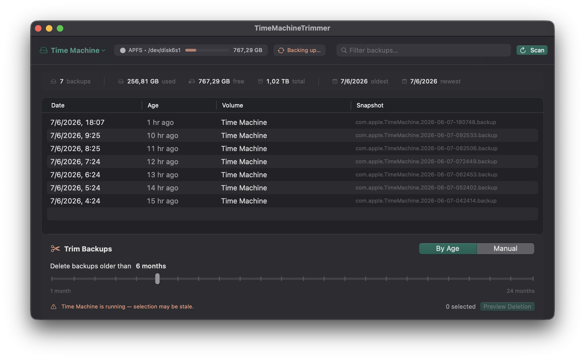

# TimeMachineTrimmer

Trim old Time Machine backups and reclaim disk space.



## Features

- **Trim snapshots** — delete old backups from any Time Machine volume
- **Reclaim space** — remove unwanted snapshots and free up disk
- **macOS-native** — lightweight, native SwiftUI app

## Install

### Homebrew

```bash
brew tap ricardoleal/tap
brew trust ricardoleal/tap/time-machine-trimmer
brew install --cask time-machine-trimmer
```

> [!NOTE]
> `brew trust` is required because the tap is private. If you don't have `gh` installed, pass your token manually:
> `HOMEBREW_GITHUB_API_TOKEN=ghp_xxx brew tap ricardoleal/tap`

### Manual

Download the latest `.dmg` from [Releases](https://github.com/ricardoleal/TimeMachineTrimmer/releases/latest), open it, and drag the app to `/Applications`.

> [!WARNING]
> The app is not signed with a paid Apple Developer ID certificate. If macOS blocks it, right-click the app in `/Applications` and select **Open**, then click **Open** in the dialog.

## Build from Source

Open `TimeMachineTrimmer.xcodeproj` in **Xcode 26+** on macOS 26 (Tahoe).

> [!IMPORTANT]
> Change the signing team to your own, otherwise entitlements may not persist.

## Contributing

Have an idea or found a bug? Open an [issue](https://github.com/ricardoleal/TimeMachineTrimmer/issues/new) first to discuss before sending a pull request. Please submit PRs from a feature branch on your fork.

## License

See [LICENSE](LICENSE).
